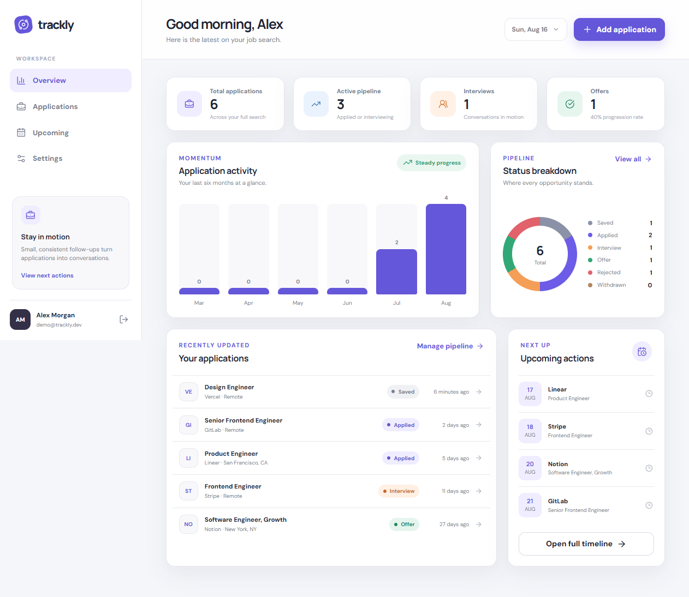
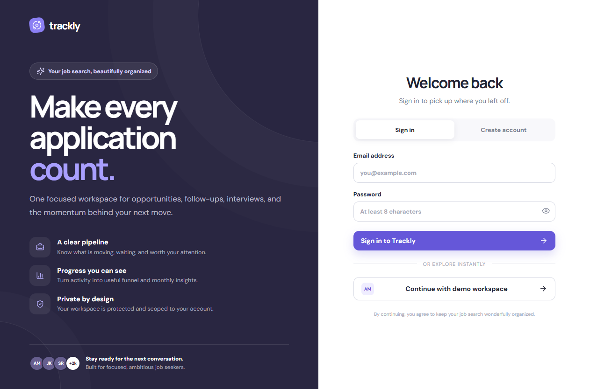
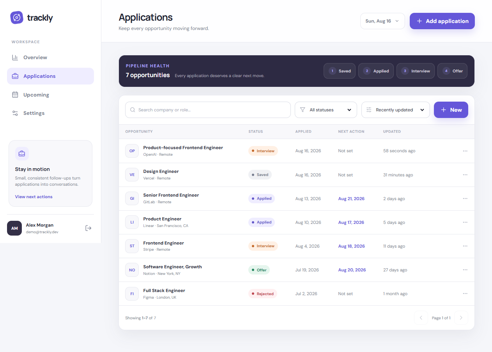
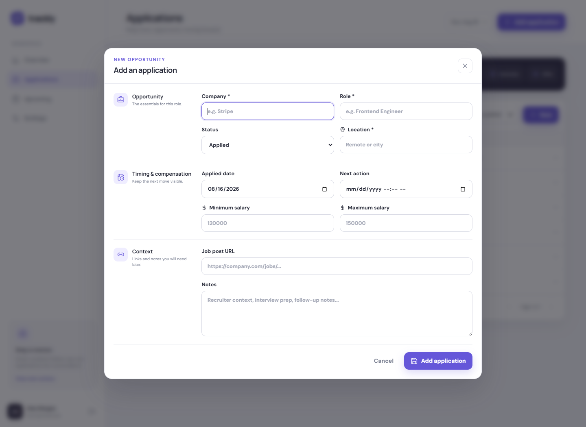
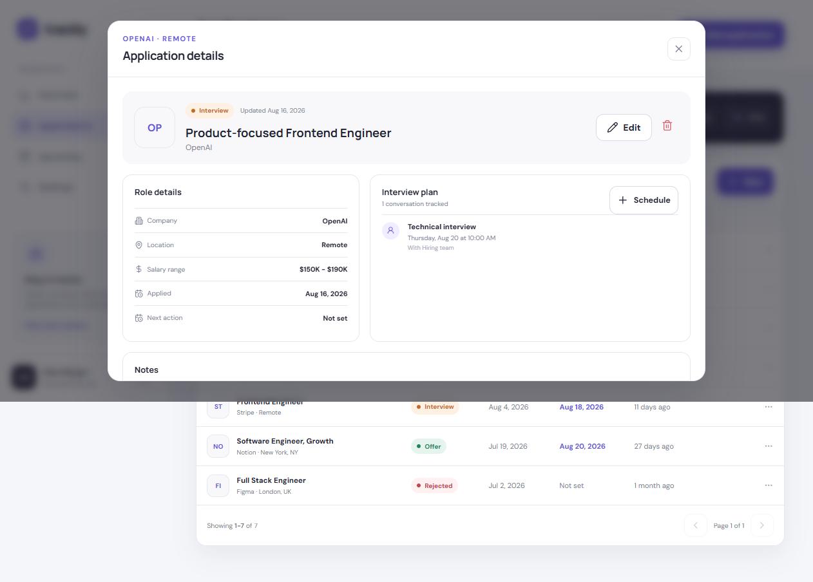
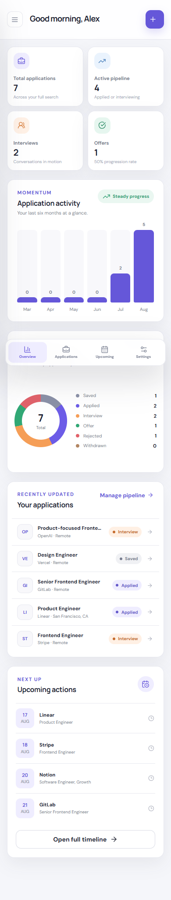

# Trackly - Job Application Tracker

Trackly is a polished full-stack workspace for managing job applications, interviews, follow-ups, offers, and job-search momentum. It combines a responsive React experience with a secure Express API, user-owned records, MongoDB persistence, and a zero-configuration seeded demo mode.



## Highlights

- Secure registration and login with bcrypt password hashing and seven-day JWT sessions.
- Ownership-safe application CRUD: records are scoped to the authenticated user in every data query.
- Six-stage pipeline: Saved, Applied, Interview, Offer, Rejected, and Withdrawn.
- Search, status/location filtering, sorting, pagination, and responsive table/card layouts.
- Dashboard metrics, six-month activity chart, funnel breakdown, progression rate, and recent updates.
- Interview scheduling with meeting details and automatic pipeline status updates.
- Upcoming-action timeline for follow-ups and interviews.
- Loading skeletons, empty/error states, toasts, confirmations, dark mode, reduced-motion support, and mobile navigation.
- Mongoose schemas, compound/text indexes, Zod validation, Helmet, CORS controls, auth rate limiting, and centralized JSON errors.
- Seeded in-memory adapter for immediate evaluation; MongoDB is selected automatically when configured.

## Product tour

| Authentication | Application pipeline |
| --- | --- |
|  |  |

### Create and edit opportunities



### Application workspace



The interface is fully responsive, including a compact mobile dashboard and bottom navigation.



## Technology

| Layer | Tools |
| --- | --- |
| Client | React 19, TypeScript, Vite, React Router, date-fns, Lucide |
| API | Node.js, Express 5, TypeScript, Zod |
| Data | MongoDB, Mongoose, in-memory development adapter |
| Security | JWT, bcryptjs, Helmet, CORS, express-rate-limit |
| Quality | Vitest, Supertest, TypeScript strict mode, browser verification |

## Architecture

```text
job-application-tracker/
├── client/
│   └── src/
│       ├── components/     reusable shell, dialogs, forms, states
│       ├── context/        authentication and toast providers
│       ├── lib/            typed API client and formatters
│       └── pages/          auth, dashboard, applications, upcoming, settings
├── server/
│   ├── src/
│   │   ├── config/         validated runtime configuration
│   │   ├── data/           MongoDB and memory data adapters
│   │   ├── middleware/     authentication and centralized errors
│   │   ├── models/         Mongoose user/application schemas
│   │   ├── routes/         REST endpoints and request validation
│   │   └── types/          shared server domain types
│   └── tests/              API and authorization integration tests
└── screenshots/            verified portfolio captures
```

The `DataStore` interface keeps route behavior identical in both modes:

```text
React UI -> typed fetch client -> Express route -> auth + Zod
         -> DataStore -> MemoryDataStore (local demo)
                      -> MongoDataStore (configured environments)
         <- consistent { success, message, data } response
```

## Run locally

### Prerequisites

- Node.js 20 or newer
- npm 10 or newer
- MongoDB Atlas/local MongoDB only if persistent storage is desired

### Installation

```bash
git clone https://github.com/dskwittahachchi/Job-Application-Tracker.git
cd Job-Application-Tracker
npm install
npm run dev
```

Open `http://localhost:5173`. The API runs at `http://localhost:5000`.

With no `MONGODB_URI`, Trackly starts in memory demo mode. Use:

```text
Email:    demo@trackly.dev
Password: Demo123!
```

Memory-mode changes reset when the API restarts. You can also register a new temporary account from the interface.

### Persistent MongoDB mode

Copy the example environment file and set your values:

```bash
cp server/.env.example server/.env
```

```dotenv
PORT=5000
MONGODB_URI=mongodb+srv://...
JWT_SECRET=use_a_long_random_secret_at_least_32_characters
CLIENT_URL=http://localhost:5173
NODE_ENV=development
```

When `MONGODB_URI` is present, the API uses Mongoose and persistent user/application collections. Register an account through the UI; the seeded demo account is intentionally limited to memory mode.

## Scripts

| Command | Purpose |
| --- | --- |
| `npm run dev` | Run the API and Vite client together |
| `npm run build` | Type-check and produce server/client builds |
| `npm test` | Run API integration and client unit tests |
| `npm run lint` | Run strict TypeScript checks in both workspaces |
| `npm run start --workspace server` | Start the compiled API |
| `npm run preview --workspace client` | Preview the production client build |

## REST API

| Method | Endpoint | Purpose |
| --- | --- | --- |
| `GET` | `/api/health` | Health and active data-mode check |
| `POST` | `/api/auth/register` | Create an account and return a JWT |
| `POST` | `/api/auth/login` | Authenticate and return a JWT |
| `GET` | `/api/auth/me` | Load the authenticated profile |
| `GET` | `/api/applications` | Search/filter/sort/paginate user applications |
| `POST` | `/api/applications` | Create an application |
| `GET` | `/api/applications/:id` | Load one user-owned application |
| `PUT` | `/api/applications/:id` | Update an application |
| `DELETE` | `/api/applications/:id` | Delete an application |
| `POST` | `/api/applications/:id/interviews` | Add an interview and update status |
| `GET` | `/api/dashboard/stats` | Return cards, charts, recent items, and upcoming actions |

Protected endpoints require `Authorization: Bearer <token>`.

```json
{
  "success": true,
  "message": "Operation completed",
  "data": {}
}
```

Validation and server failures use the same envelope with `success: false` and a readable `errors` array.

## Security and reliability

- Passwords are hashed with bcrypt and are never returned by the API.
- JWT verification happens server-side for every private route.
- Ownership is included in read/update/delete queries, preventing cross-account ID access.
- Request bodies and query parameters are validated before reaching the data adapter.
- Authentication routes are rate limited; Helmet and production CORS restrictions are enabled.
- MongoDB indexes support user/status/date filters and company/role search.
- Secrets and environment files are excluded from Git.
- Render failures fall back to a recoverable application-level error boundary.

## Verification

The final implementation was verified with:

- A successful production build for both workspaces.
- Six passing automated tests covering authentication, unauthorized access, ownership isolation, CRUD, salary validation, interview creation, dashboard output, and formatting.
- A browser walkthrough of demo login, dashboard rendering, application creation, application details, interview scheduling, responsive mobile layout, and a clean final console/page-error check.

## Current scope and roadmap

This repository completes the v1.0 user MVP from the project blueprint. The optional admin role and external services are intentionally not included in the core build.

Good next additions:

- Transactional email reminders and notification delivery.
- CSV import/export.
- Browser extension for saving roles from job boards.
- AI-assisted job-description/CV matching.
- Kanban pipeline view and drag-and-drop status updates.
- Dedicated admin aggregate metrics.

## What this project demonstrates

Trackly is structured as a vertical full-stack product rather than a collection of disconnected screens. The same validated domain model flows from UI forms through authorization and storage to analytics, while the adapter boundary keeps local evaluation effortless and production persistence explicit.
